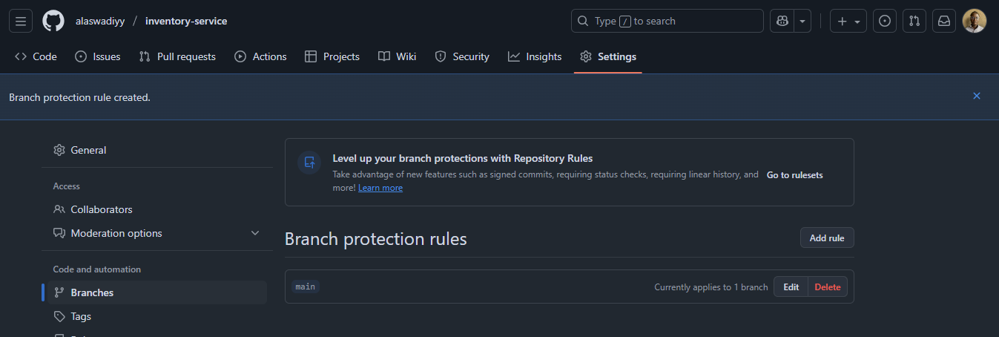

# Inventory Service

A lightweight Golang API for BlueSky Logistics inventory management that exposes /items and /status endpoints.

## Endpoints
- `GET /status` - Returns "OK" for health checks
- `GET /items` - Returns JSON array of sample items

## CI/CD Pipeline

### Pipeline Stages

1. **Matrix Tests**
   - Uses reusable workflow: `your-org/platform-ci/.github/workflows/go-matrix-test.yml`
   - Tests across multiple Go versions (1.22-1.25)
   - Tests on multiple OSes (Ubuntu, macOS, Windows)
   - Matrix defined in the reusable workflow, not in service repo

2. **Docker Build & Push**
   - Uses reusable workflow: `your-org/platform-ci/.github/workflows/build-and-push-image.yml`
   - Builds Docker image from the codebase
   - Tags with commit SHA: `ghcr.io/<username>/inventory-service:<sha>`
   - Pushes to GitHub Container Registry (GHCR)

3. **Kubernetes Deployment**
   - Uses reusable workflow: `your-org/platform-ci/.github/workflows/deploy-k8s.yml`
   - Deploys only to `main` branch after successful Docker build
   - Deploys to `inventory-staging` namespace
   - Updates `inventory-service` deployment with new image

### Secrets Management

Secrets stored in repository settings:

| Secret Name | Purpose |
|-------------|---------|
| `REGISTRY_USERNAME` | Docker registry username |
| `REGISTRY_PASSWORD` | Docker registry password/PAT |
| `KUBECONFIG_STAGING` | kubeconfig for staging cluster |
| `GITHUB_TOKEN` | GitHub token for workflows |

Secrets are passed to reusable workflows via `secrets` parameter.

### Branching Strategy

1. Create feature branch: `feature/pipeline-setup`
2. Make small, incremental commits
3. Open Pull Request to `main`
4. All CI checks must pass
5. PR review required
6. Merge via squash or rebase

### Branch Protection Rules
- No direct pushes to `main`
- PR reviews required
- All CI checks must pass
- Linear history enforced



## Local Development

### Prerequisites
- Go 1.22 or later
- Docker Desktop (Windows 10/11 Pro/Enterprise) OR Podman (for older Windows versions)

### Running Locally

```bash
# Run locally
go run main.go

# Test endpoints
curl http://localhost:8080/status
curl http://localhost:8080/items
```

### Docker / Container Setup

**Option 1: Docker Desktop (Windows 10/11 Pro/Enterprise)**
```bash
# Build Docker image
docker build -t inventory-service:latest .

# Run container
docker run -p 8080:8080 inventory-service:latest
```

**Option 2: Podman (Alternative for older Windows versions)**
If Docker Desktop is not compatible with your Windows version, use Podman instead:

```powershell
# Install Podman (one-time)
winget install RedHat.Podman

# Build image with Podman
podman build -t inventory-service:latest .

# Run container with Podman
podman run -p 8080:8080 inventory-service:latest
```

Podman uses the same commands as Docker and is fully compatible.

> **Note:** Docker builds and image pushes are handled by the CI/CD pipeline in GitHub Actions. Local Docker/Podman setup is optional for development.